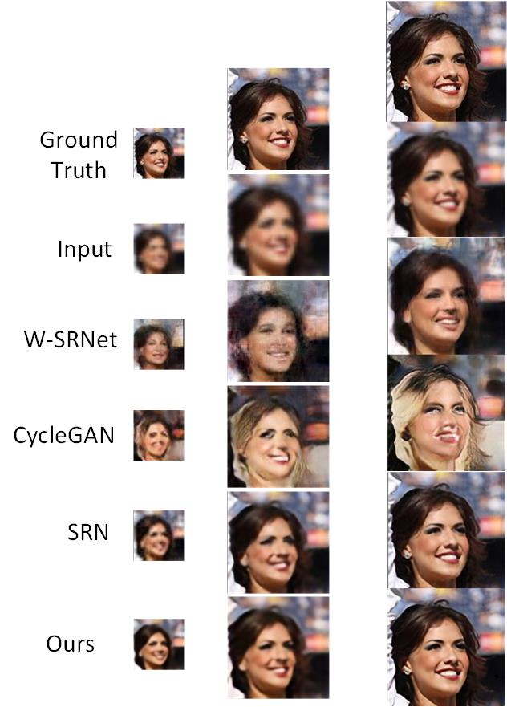

# Stacked-GAN-Face-SR
Face Synthesis and Super Resolution Using Stacked Generative Adversarial Network

## 1. Dataset generate
- a.Using [HD CelebA Cropper](https://github.com/LynnHo/HD-CelebA-Cropper) to generate the dataset raw data.
- b.Use the default 0.7 face_factor.
- c.Copy the raw data to dataset folder.
- c.Run **1.get_celeb_train.py** to generate training, validating and testing data

## 2. Training
- a.Run the training command
`python 2.train_and_test.py --phase train --dataset_name yourData --origin_size 64 --image_size 256`
- b.Check the sample folder during training to make sure the result is correct.

## 3. Testing
- a.Run the testing command
`python 2.train_and_test.py --phase test --dataset_name yourData --origin_size 64 --image_size 256`
- b.Check the generated test folder for the results

## 4. Calculate FID
- a.The FID calculating code is from [here](https://github.com/mseitzer/pytorch-fid)
- b.Run **3.split_testset.py** to seperate blur tesing images and ground truth
- c.Run the FID calculating command
`python 4.fid_score.py dataset/yourData/gt test`

## 5. FID results
Table 1 FID score compare in different resolution transformation
name|16 to 64|32 to 128|64 to 256
--|--|--|--
Wavelet SRNet |45.952|54.533|31.929
Cycle GAN |63.837|32.228|42.218
SRN-Deblur |125.576|41.463|12.729
ours |51.646|29.685|13.431

## 6. Images results

